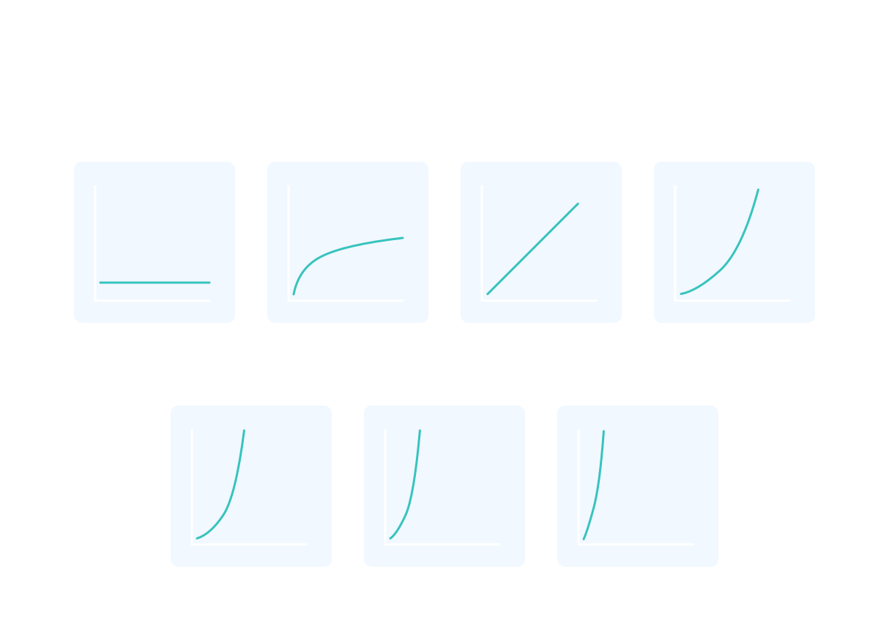

# Asymptotic Notation

- We use asymptotic notation to describe the runtime of a program. The three types of asymptotic notation are big Theta, big Omega, and big O.
- We typically describe a program’s running time in terms of big O.
- When analyzing the runtime of a program, we care about which part of the program is the slowest.

### Big Theta (Θ)
- We use big Theta when a program has only one case in terms of runtime.
- The number of instructions the computer has to perform is based on how many iterations the loop will do because if the loop does more iterations, then the computer will perform instructions.

        Function that has integer input N:
            Set a count variable to 0
            Loop while N is not equal to 1:
                Increment count
                N = N/2
            Return count

- As we can see, in every case, with an integer N, the loop will iterate log2(N) times. However, because we drop constants in asymptotic notation, we would say that the runtime of this program is Θ(log N).

### Common Runtimes (from fastest to slowest)

- Θ(1). This is constant runtime. This is the runtime when a program will always do the same thing regardless of the input. For instance, a program that only prints “hello, world” runs in Θ(1) because the program will always just print “hello, world”.
- Θ(log N). This is logarithmic runtime. You will see this runtime in search algorithms.
- Θ(N). This is linear runtime. You will often see this when you have to iterate through an entire dataset.
- Θ(N*logN). You will see this runtime in sorting algorithms.
- Θ(N2). This is an example of a polynomial runtime. When N is raised to the 2nd power, it’s known as a quadratic runtime. You will see this runtime when you have to search through a two-dimensional dataset (like a matrix) or nested loops.
- Θ(2N). This is exponential runtime. You will often see this runtime in recursive algorithms (Don’t worry if you don’t know what that is yet!).
- Θ(N!). This is factorial runtime. You will often see this runtime when you have to generate all of the different permutations of something. For instance, a program that generates all the different ways to order the letters “abcd” would run in this runtime.

### Big Omega (Ω) and Big O (O)
- Sometimes, a program may have a different runtime for the best case and worst case. 
- For instance, a program could have a best case runtime of Θ(1) and a worst case of Θ(N). 
- We use a different notation when this is the case. 
- We use big Omega or Ω to describe the best case and big O or O to describe the worst case.
- Evaluated based on size of input arguments.

        Function with input that is a list of size N:
            For each value in the list:
                If value is equal to 12:
                    Return True
            Return False

    - This program has a best case runtime of Θ(1).
    - This program has a worst case runtime of Θ(N).
    - This program has a runtime of Ω(1).
    - This program has a runtime O(N).

### Adding Runtimes
- With a function that has multiple parts, divide up the parts and find the run time of each parts
- Add the runtimes together
- Use the dominant runtime (the slowest) to apply to the overall function

### Space Complexity
- Asymptotic notation is often used to describe the runtime of a program or algorithm, but it can also be used to describe the space, or memory, that a program or algorithm will need.
- Think about a simple function that takes in two numbers and returns their sum:

        function addNumbers(a, b) {
            return a + b;
        }
    
    - This function has a space complexity of O(1), because the amount of space it needs will not change based on the input. 
- While this function also has a constant runtime of O(1), most functions do not have matching space and time complexities:

        function simpleLoop(inputArray) {
            for (let i = 0; i < inputArray.length; i++) { 
                console.log(i);
            }
        }

    - As we know, a simple for loop that goes through every element in an array of size n has a linear runtime of O(n). However, this function takes O(1) space since no new variables are being created and therefore no more space must be allocated.
- A recursive function that is passed the same array or object in each call doesn’t add to the space complexity if the array or object is passed by reference (which it is in JavaScript).
- Like with time complexity, space complexity denotes space growth in relation to the input size. 
    - It’s also important to note that space complexity usually refers to any additional space that will be needed, and doesn’t count the space of the input. 
    - So a function could have 10 arrays passed into it, but if all it does inside is print 'Hello World!', then it still takes O(1) space.