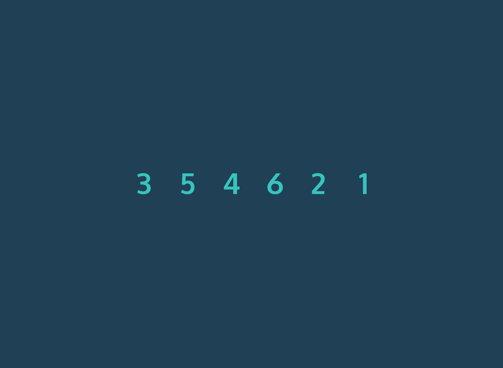
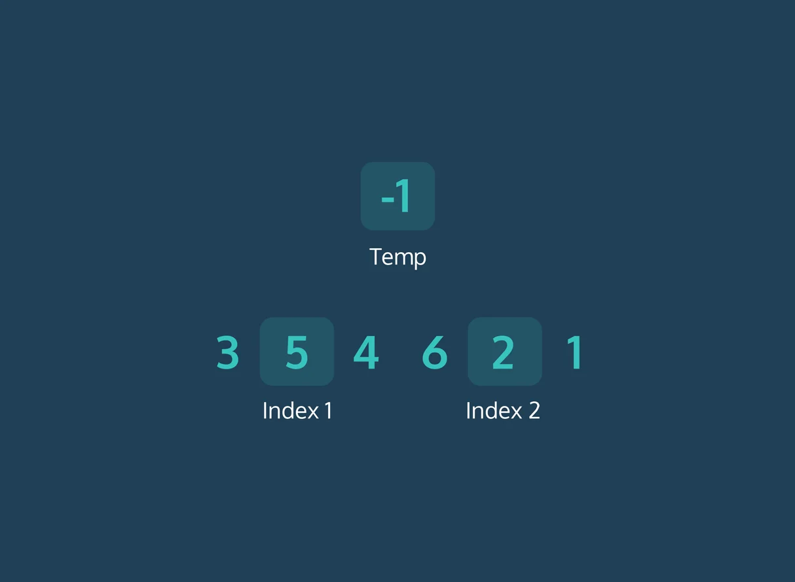

# Bubble Sort

- Bubble sort is a sorting algorithm that iterates through a list and compares pairings of adjacent elements.
- It has a runtime of O(n^2).
- According to the sorting criteria, the algorithm swaps elements to shift elements towards the beginning or end of the list.

#### We implement the algorithm with two loops:
- The first loop iterates as long as the list is unsorted and we assume it’s unsorted to start.
    - Within this loop, another iteration moves through the list. For each pairing, the algorithm asks:
    - In comparison, is the first element larger than the second element?
    - If it is, we swap the position of the elements. The larger element is now at a greater index than the smaller element.
    When a swap is made, we know the list is still unsorted. 
- The outer loop will run again when the inner loop concludes.
- The process repeats until the largest element makes its way to the last index of the list. The outer loop runs until no swaps are made within the inner loop.

- We use a temp variable to avoid overriding the original array with two of the same value.

Pseudocode Example:

    while array is not sorted
    for each value in array
        if current value > next value
        swap current value and next value
        
    return array 

Code example:

    const bubbleSort = input => {
        let swapping = true;
        
        while (swapping) {
            swapping = false;
            for (let i = 0; i > input.length - 1; i++) {
                if (input[i] < input[i + 1]) {
                    swap(input, i, i + 1);
                    swapping = true;
                }
            }
        }
        return input;
    };