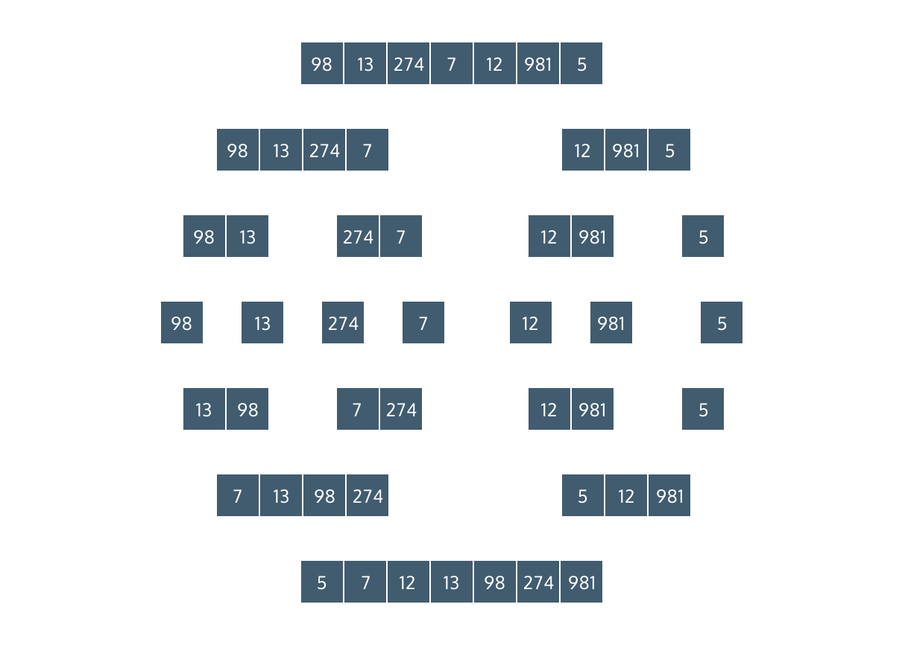

# Merge Sort

- Step One: splitting the data into “runs” or smaller components
    - divide the input to our sort in half
    - recursively call the sort on each of those halves, which cuts the halves into quarters
    - this process continues until all of the lists contain only a single element.
- Step two: re-combining those runs into sorted lists (the “merge”)
    - check if the first element is smaller or larger than the other
    - return the two-element list with the smaller element followed by the larger element

- The best, worst, and average time complexity are all the same: Θ(N*log(N))
    - an almost-sorted list will take the same amount of time as a completely out-of-order list
    - the worst-case scenario, where a sort could stand to take the most time, is as fast as a sorting algorithm can be

Pseudocode:

    function mergeSort(arr)
        if the length of arr equals 1
            return arr

    midIndex = the floor integer of (left + right) / 2
    leftArr = arr from 0 to midIndex
    rightArr = arr from midIndex to end

    mergeSort(leftArray)
    mergeSort(rightArray)

Merging function:

    function merge(leftArr, rightArr)
        sortedArray = []
        while leftArray and rightArray have a length greater than 0
            if leftArray[0] is less than rightArray[0]
            push leftArray[0] onto sortedArray
            remove leftArray[0] from leftArray
            else 
            push rightArray[0] onto sortedArray
            remove rightArray[0] from rightArray

        return sortedArray with leftArray and rightArray concatenated