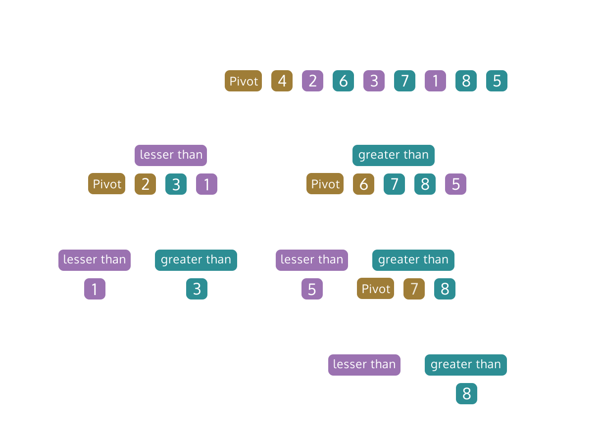

# Quicksort

- The key to Quicksort’s runtime efficiency is the division of the array. 
- Array is divided according to the pivot element to find the elements that satisfy the base case.
    - A single element, the pivot, is chosen from the list. All the remaining values are partitioned into two sub-lists containing the values smaller than and greater than the pivot element.
    - Ideally, this process of dividing the array will produce sub-lists of nearly equal length, otherwise, the runtime of the algorithm suffers.
    - When the dividing step returns sub-lists that have one or less elements, each sub-list is sorted. The sub-lists are recombined, or swaps are made in the original array, to produce a sorted list of values.
- Quicksort is an unusual algorithm in that the worst case runtime is O(N^2), but the average case is O(N * logN).
    - One popular strategy is to select a random element as the pivot for each step.
        - The benefit is that no particular data set can be chosen ahead of time to make the algorithm perform poorly.
    - Another popular strategy is to take the first, middle, and last elements of the array and choose the median element as the pivot.
        - The benefit is that the division of the array tends to be more uniform.

Pseudocode:

    If there is more than one element left in the array:
    Find the pivot index through partitioning

    If the left pointer is less than the pivot index:
        Call quicksort() on the portion of the array between the left pointer and the pivot. 

    If the pivot index is less than the right pointer:
        Call quicksort() on the portion of the array between the pivot index and the right pointer.

    Return the sorted array