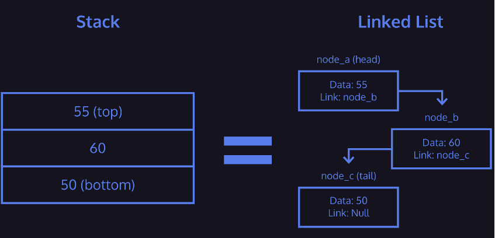

# Stacks

Stacks

- Contain data nodes
- Support three main operations
    - Push adds data to the top of the stack
    - Pop removes and provides data from the top of the stack
    - Peek reveals data on the top of the stack
- Implementations include a linked list or array
- Can have a limited size
- Pushing data onto a full stack results in a stack overflow
- Stacks process data Last In, First Out (LIFO)

