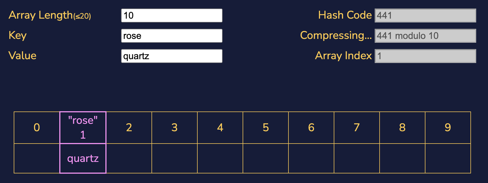
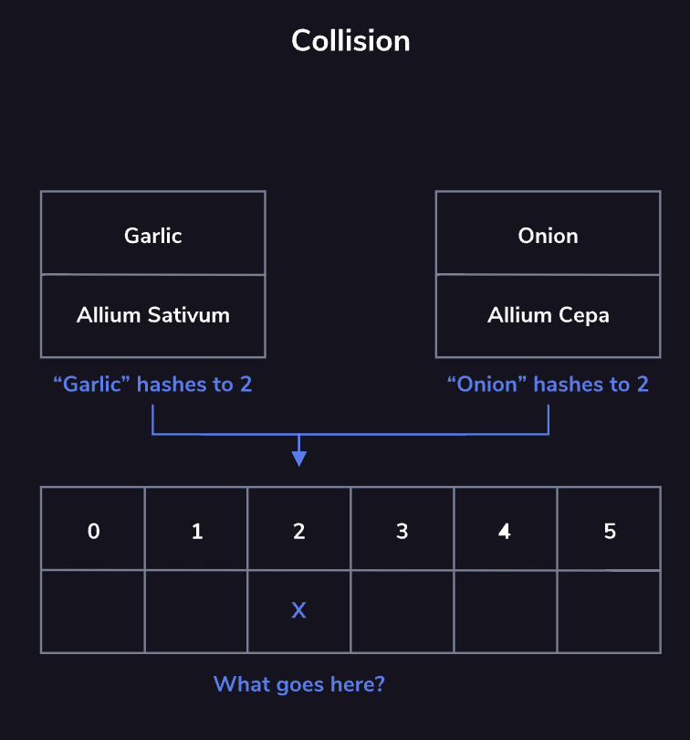
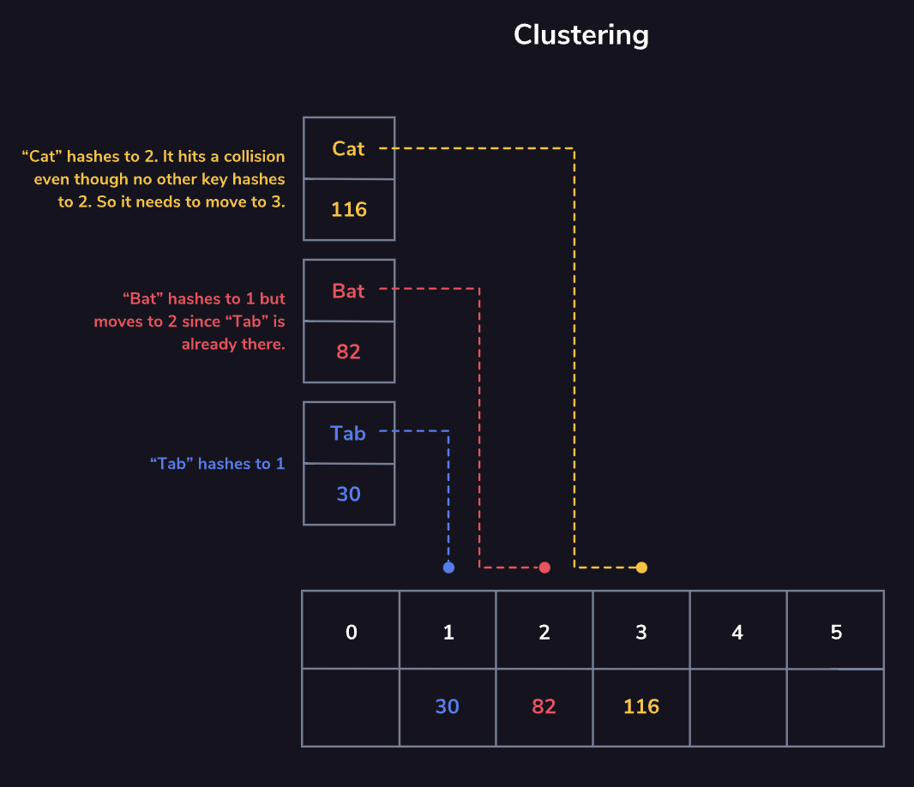

# Hash Maps

Hash Maps
- In order for a relationship to be a map, every key that is used can only be the key to a single value
- A given input, when fed into the map, gives the accurate output
- <i>Hashing function</i>: a function that turns data into a string in order to get the value per key
    - A hash function takes a string as input and returns an array index as output. In order for it to return an array index, our hash map implementation needs to know the size of our array.
    - In order for our hash map implementation to guarantee that it returns an index that fits into the underlying array, the hash function will first compute a value using some scoring metric: this is the hash value, hash code, or just the hash. 
    - Our hash map implementation then takes that hash value mod the size of the array. This guarantees that the value returned by the hash function can be used as an index into the array we’re using.
    - Is <i>deterministic</i>: the hashing function must always return the same index when given the same key.
- Hash functions are also known as <i>compression functions</i>
    - <i>Compression</i> means taking some input and returning an output only within a specific range.
    - All hash functions greatly reduce any possible inputs (any string you can imagine) into a much smaller range of potential outputs (an integer smaller than the size of our array)
- Write a hash function
    - needs to be simple by design
    - need to be able to take whatever types of data we want to use as a key (string, number)
- A <i>hash bucket</i> is the storage location at the index given by a hash
    - First, the key is translated into the hash using our hashing function. Then, our hash map performs modulo arithmetic to turn the hash into an array index.

- A <i>hash collision</i> is when a hash function might produce the same hash for two different keys
    - Hash functions are designed to compress data from a large number of possible keys to a much smaller range, and the compression can cause has collision.
    - The <i>separate chaining</i> strategy avoids collisions by updating the underlying data structure. Instead of an array of values that are mapped to by hashes, it could be an array of linked lists.
    - The <i>open addressing</i> strategy avoids collisions stick to the array as our underlying data structure, but we continue looking for a new index to save our data if the first result of our hash function has a different key’s data.

- Separate chaining involves assigning two keys with the same hash to different parts of the underlying data structure
    - If we save both the key and the value, then we will be able to check against the saved key when we’re accessing data in a hash map. By saving the key with the value, we can avoid situations in which two keys have the same hash code where we might not be able to distinguish which value goes with a given key.
    - Now, when we go to read or write a value for a key we do the following: calculate the hash for the key, find the appropriate index for that hash, and begin iterating through our linked list. For each element, if the saved key is the same as our key, return the value. Otherwise, continue iterating through the list comparing the keys saved in that list with our key.

- Open Addressing: <i>Linear Probing</i>: open method of open addressing where we continue to find new array indices in a fixed sequence until an empty index is found.

- <i>Clustering</i> is what happens when a single hash collision causes additional hash collisions. 
    - Imagine a hash collision triggers a linear probing sequence to assigns a value to the next hash bucket over. Any key that would hash to this “next bucket” will now collide with a key that, in a sense, doesn’t belong to that bucket anyway.
    - As a result the new key needs to be assigned to the next, next bucket over. This propagates the problem because now there are two hash buckets taken up by key-value pairs that were assigned as a result of a hash collision, displacing further pairs of information we might want to save to the table.

Summary: 
- A hash map is:
    - Built on top of an array using a special indexing system
    - A key-value storage with fast assignments and lookup
    - A table that represents a map from a set of keys to a set of values
- Hash maps accomplish all this by using a hash function, which turns a key into an index into the underlying array.
- A hash collision is when a hash function returns the same index for two different keys.
- There are different hash collision strategies:
    - separate chaining, where each array index points to a different data structure
    - open addressing, where a collision triggers a probing sequence to find where to store the value for a given key.