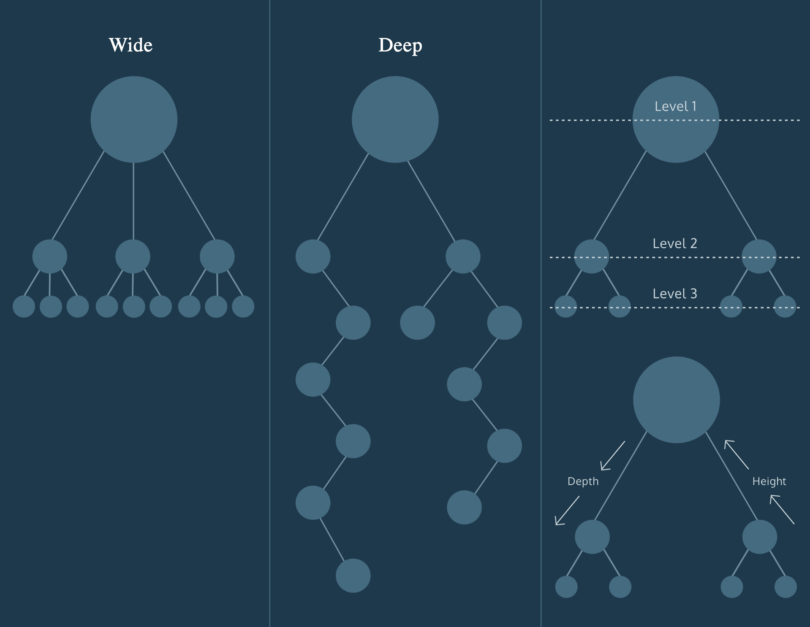
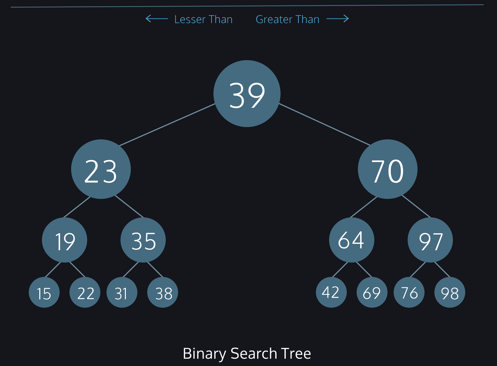

# Trees

Trees grow downwards in computer science, and a root node is at the very top.
- root: A node which has no parent. One per tree.
- parent: A node which references other nodes.
- child: Nodes referenced by other nodes.
- sibling: Nodes which have the same parent.
- leaf: Nodes which have no children.
- level: The height or depth of the tree. Root nodes are at level 1, their children are at level 2, and so on.

Trees come in various shapes and sizes depending on the dataset modeled.
- Some are wide, with parent nodes referencing many child nodes.
- Some are deep, with many parent-child relationships.
- Trees can be both wide and deep, but each node will only ever have at most one parent; otherwise, they wouldn’t be trees!

## Binary Search Tree

A binary tree is a type of tree where each parent can have no more than two children, known as the left child and right child.
- Left child values must be lesser than their parent.
- Right child values must be greater than their parent.

The constraints of a binary search tree allow us to search the tree efficiently. At each node, we can discard half of the remaining possible values.

Now that we can add nodes to our tree, the next step is to be able to traverse the tree and display its content. We can do this in one of two ways: depth-first or breadth-first.
- Depth-first traversal visits the first child in the children array and that node’s children recursively before visiting its siblings and their children recursively. 
    - it is a recursive method that fully traverses the tree with a top-down approach for each child of the tree
- Breadth-first traversal visits each child in the children array starting from the first child before visiting their children and further layers until the bottom level is visited. 
    - it is an iterative method that fully traverses the tree a level at a time, instead of a child at a time