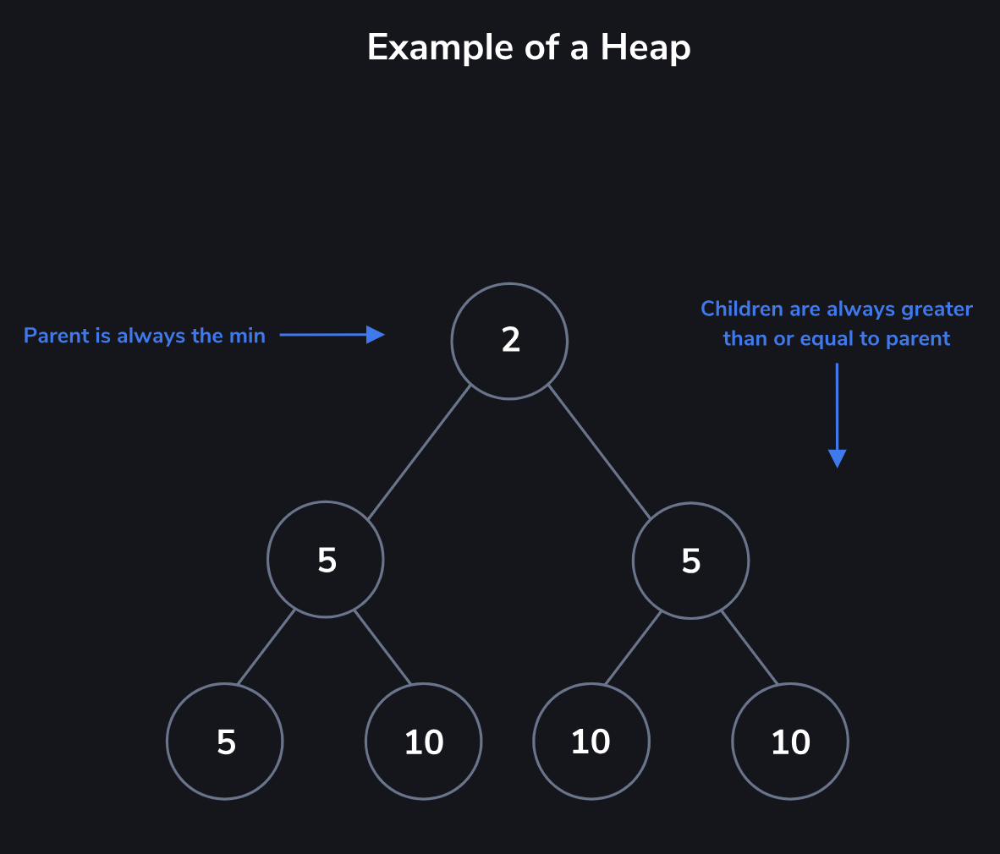
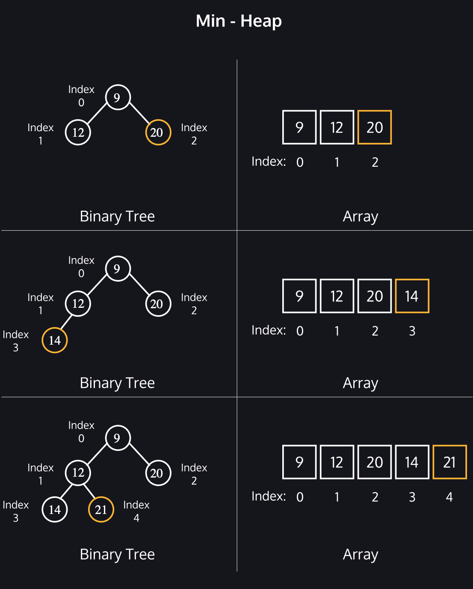
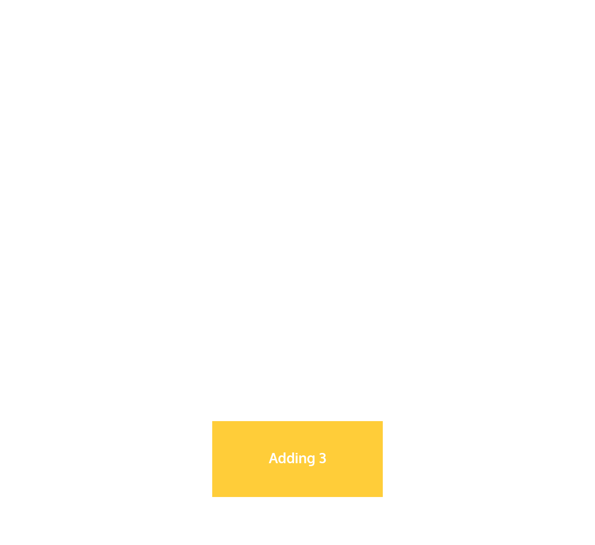
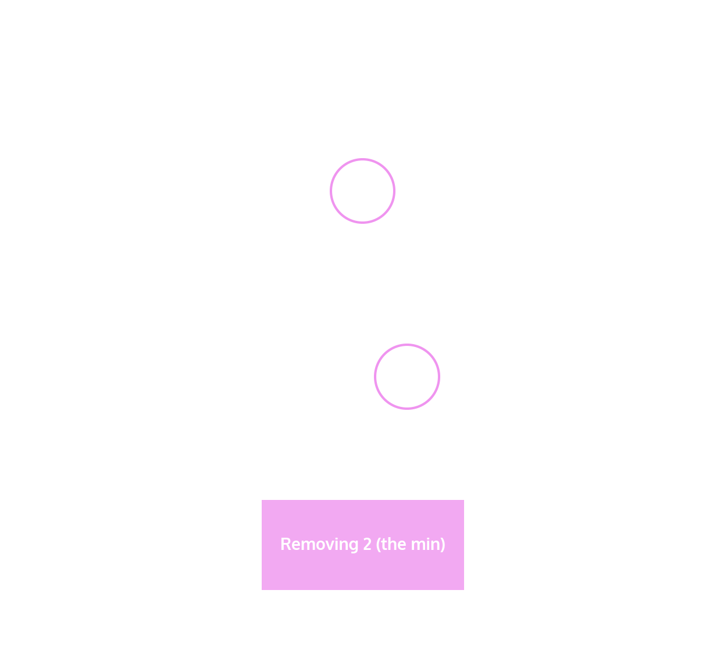

# Heaps

Heaps are used to maintain a maximum or minimum value in a dataset.
- Heaps are commonly used to create a priority queue.
- Heaps tracking the maximum or minimum value are max-heaps or min-heaps. 
- The “root” node, or first element in the array, is removed from trhe heap
- Think of the min-heap as a binary tree with two qualities:
    - The root is the minimum value of the dataset.
    - Every child’s value is greater than or equal to its parent.
- Max Heap will have the following qualities:
    - The “root” or first element is the largest value.
    - Every child is a lesser value than their parent.

Heapify: when adding or removing an element, they need to be moved to the correct place in the tree
- Heapify Up: add an element to the bottom of the tree and move it up
    - Min-Heap: While there is a parent for an element and the parent is greater, the element swaps locations with the parent.

- Heapify Down: add an element from the top of the tree and move it down
    - The element at the bottom right of the tree, or last element in the array, first replaces the root before heapifying down
    - Max-Heap: While there is a child for an element and the child is greater, the element swaps locations with the child.

