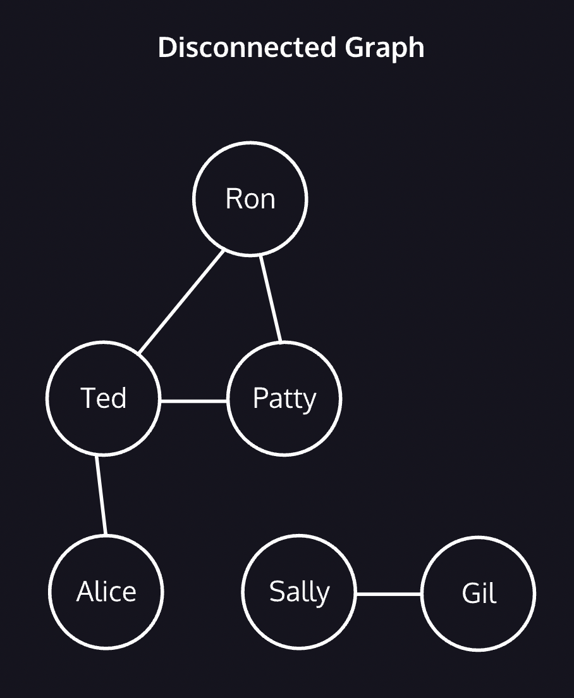
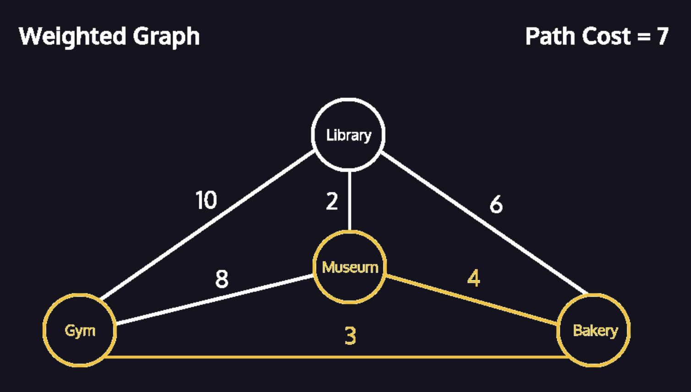
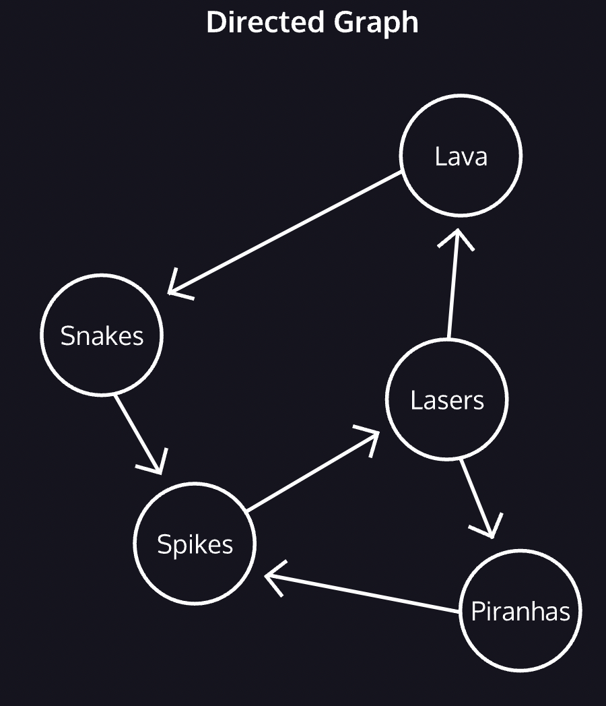
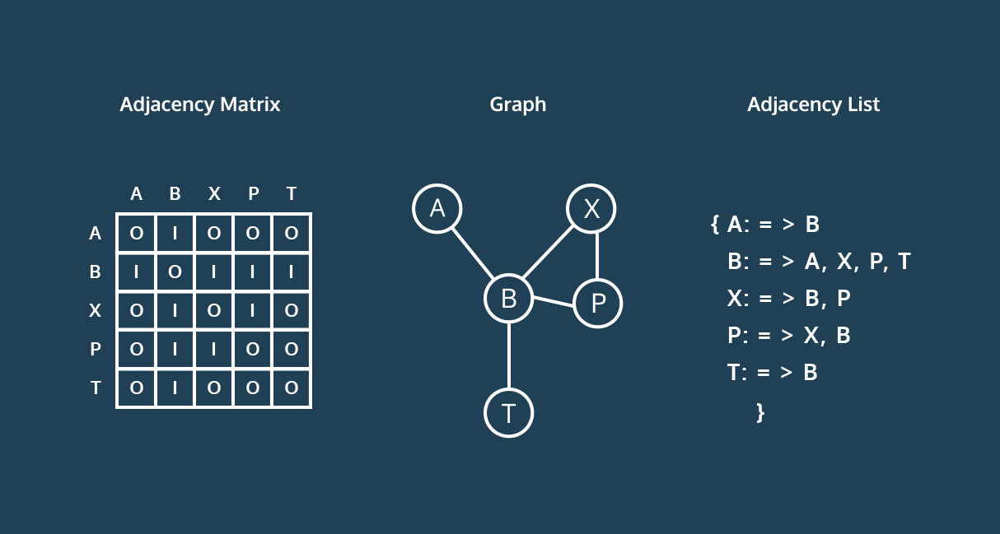

# Graphs

Graphs
- Composed of nodes, or <i>vertices</i>, which hold data, and <i>edges</i>, which are a connection between two vertices. 
- A single node is a <i>vertex</i>.
- Graphs have varying degrees of connection. The higher the ratio of edges to vertices, the more connected the graph.

Graphs are a good data structure for modeling networks
- As a graph, we could model bus stops as vertices, with bus routes between stops functioning as the edges.
- Web pages can be vertices, and the hyperlinks which connect them are edges.

## Disconnected Graphs

- Ted is adjacent to Patty, Ron, and Alice because an edge directly connects them.
- We use a single line for an edge, but these friendships are <i>bi-directional.</i> Patty is friends with Ron and Ron is friends with Patty.
- <i>A path is vertices which are connected by any number of intermediate edges.</i> The paths from Alice to Patty could go Alice to Ted to Patty or, Alice to Ted to Ron to Patty.
- No path exists between Sally and Ted. When no path exists between two vertices, a graph is <i>disconnected.</i>

## Weighted Graphs

- Not all edges are equal
- This is a weighted graph, where edges have a number or cost associated with traveling between the vertices. When tallying the cost of a path, we add up the <i>total cost</i> of the edges used.
- It takes longer to travel between Gym and Museum than it does to travel between Museum and Bakery.
- These costs are essential to algorithms that find the shortest distance between two vertices.
- Gym and Library are adjacent, there’s one edge between them, but there’s less total cost to travel from Gym to Bakery to Library (10 vs. 9).
- In a weighted graph, the shortest path is not always the least expensive.

## Directed Graphs

- Directed Graphs: where edges restrict the direction of movement between vertices.
- We can move from spikes to lasers, but not from lasers to spikes. This differs from earlier examples when every edge was bi-directional.
- Note the path spikes to lasers to piranhas to spikes. This path is a <i>cycle</i>, because it ends on the vertex where it began: spikes.

---

### Adjancency Matrix
- An adjacency matrix is a table. 
- Across the top, every vertex in the graph appears as a column. 
- Down the side, every vertex appears again as a row. 
- Edges can be bi-directional, so each vertex is listed twice.

### Adjacency List
- Each vertex contains a list of the vertices where an edge exists. 
- To find an edge, one looks through the list for the desired vertex.

## Terms

- vertex: A node in a graph.
- edge: A connection between two vertices.
- adjacent: When an edge exists between vertices.
- path: A sequence of one or more edges between vertices.
- disconnected: Graph where at least two vertices have no path connecting them.
- weighted: Graph where edges have an associated cost.
- directed: Graph where travel between vertices can be restricted to a single direction.
- cycle: A path which begins and ends at the same vertex.
- adjacency matrix: Graph representation where vertices are both the rows and the columns. Each cell represents a possible edge.
- adjacency list: Graph representation where each vertex has a list of all the vertices it shares an edge with.

## Creating a Graph

- A Vertex can store any data.
- A Vertex maintains a list of connections to other vertices, represented by a list of Edge instances.
- A Vertex can add and remove edges going to another Vertex.
- A Graph stores all of its vertices, represented by a list of Vertex instances.
- A Graph knows if it is directed or undirected.
- A Graph knows if it is weighted or unweighted.
- A Graph can add and remove its own vertices.
- A Graph can add and remove edges between stored vertices.