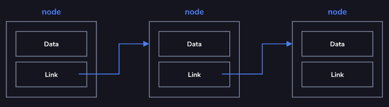
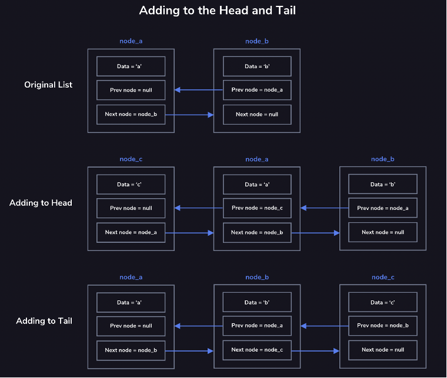

# Linked Lists

## Singly Linked Lists

Linked List: basic data structure
- Comprised of a series of nodes, each node contains a data and link to the next node in a list
- Can be unidirectional or bidirectional
- Head node = beginning of list
- Tail node = end of list, when the node’s link is null
- Operations: add node, remove node, find a node, traverse through linked list
    - Add to beginning of list: link new node to current head node
    - Remove a node: be sure to change the link to that node so that it goes to following node, not to the removed node

## Doubly Linked Lists

Doubly Linked Lists
- Are comprised of nodes that contain links to the next and previous nodes
- Are bidirectional, meaning it can be traversed in both directions
- Have a pointer to a single head node, which serves as the first node in the list
- Have a pointer to a single tail node, which serves as the last node in the list
- Require the pointers at the head of the list to be updated after addition to or removal of the head
- Require the pointers at the tail of the list to be updated after addition to or removed of the tail
- Require the pointers of the surrounding nodes to be updated after removal from the middle of the list

