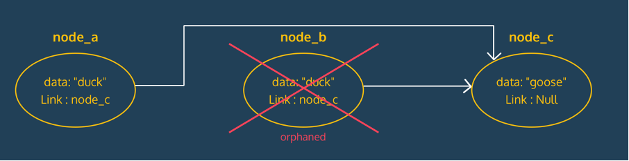

# Nodes

Nodes: building blocks on computer science data structures
- Contains data and links to other nodes
- Basis for linked lists, stacks, queues, trees, etc.
Can be a variety of types
- Data structures implement nodes with one or more links
- If link is null, reached the end of the node path

- Orphaned node: when you inadvertently remove a single link to a node, linked nodes could be “lost” to application

