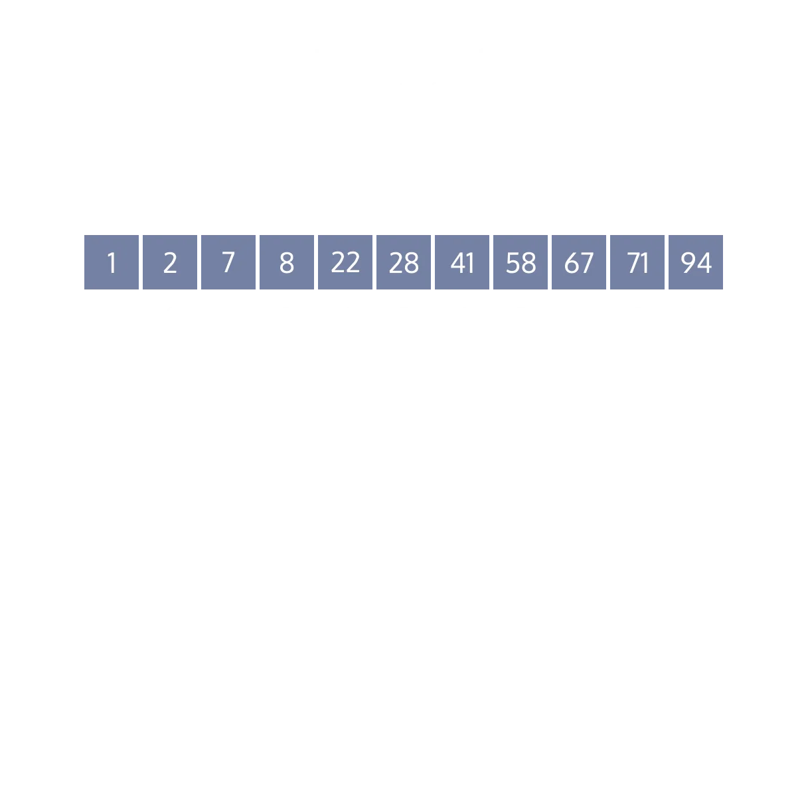

# Binary Search

Binary search requires a sorted data-set. We then take the following steps:

1. Check the middle value of the dataset.
    - If this value matches our target we can return the index.
    - If the middle value is less than our target
        - Start at step 1 using the right half of the list.
    - If the middle value is greater than our target
        - Start at step 1 using the left half of the list.
- We eventually run out of values in the list or find the target value.

In each iteration, we are cutting the list in half. The time complexity is O(log N).

A key step in each binary search iteration is to find the middle value of the current list context. In practice, we do this by tracking the first and last indices, then finding their average.

Pseudocode:

    function binarySearch (arr, target)
        left = 0
        right = length of arr

        indexToCheck = the floor integer of (left + right) / 2
        
        checking = value of arr at indexToCheck

        while right is greater than left
            indexToCheck = the floor integer of (left + right) / 2 
            checking = value of arr at indexToCheck

        if checking is the target
            then return indexToCheck
        if target is greater than checking
            then set left to indexToCheck + 1
        else
            set right to indexToCheck

Code:

    const binarySearch = (arr, target) => {
        let left = 0;
        let right = arr.length;
        
        while (right > left) {
            const indexToCheck = Math.floor((left + right) / 2);
            const checking = arr[indexToCheck];
            console.log(`indexToCheck equals: ${indexToCheck}`)
        
            if (checking === target) {
                return indexToCheck;
            } else if (checking < target) {
                left = indexToCheck + 1;
            } else {
                right = indexToCheck;
            }
        }
        return null;
    }

