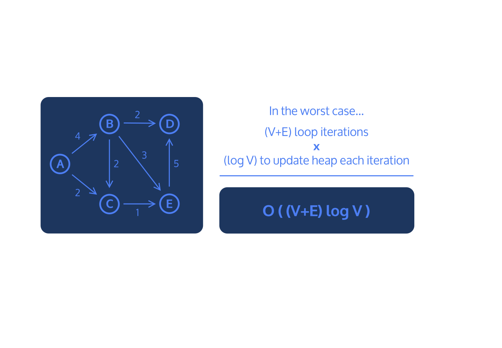

# Dijkstra's Algorithm

- Dijkstra’s algorithm is a method for finding the shortest distance from a given point to every other point in a weighted graph. 
- Keeps track of all the distances
- Updating the distances as it conducts a breadth-first search. 
- A common application of this algorithm is to find the quickest route from one destination to another.

Dijkstra’s Algorithm works as following:

1. Instantiate a dictionary that will eventually map vertices to their distance from the start vertex
2. Assign the start vertex a distance of 0 in a min heap
3. Assign every other vertex a distance of infinity in a min heap
4. Remove the vertex with the smallest distance from the min heap and set that to the current vertex
5. For the current vertex, consider all of its adjacent vertices and calculate the distance to them as (distance to the current vertex) + (edge weight of current vertex to adjacent vertex).
6. If this new distance is less than the current distance, replace the current distance.
7. Repeat 4 and 5 until the heap is empty
8. After the heap is empty, return the distances

Dijkstra’s algorithm runs in O((E+V)log V)
- Use a min-heap to keep track of all the distances
    - Searching through and updating a min-heap with V nodes takes O(log V) because in each layer of the min-heap, we reduce the number of nodes we are looking at by a factor of 2.

Code implementation will take the following steps:

1. Evaluate the distances between the starting vertex and its neighbors
2. If the new distance to the neighbor is lower than the previous distance, record it, and queue up the neighbor
3. Dequeue the next vertex to evaluate
4. Repeat steps 2 - 3 until there are no more vertices left in the queue.

Psudeocode:

    distances = {}
    previous = {}
    queue = priority queue

    add starting vertex to queue

    for every vertex in the graph:
        distances[vertex] = Infinity
        previous[vertex] = null

    distances[starting vertex] = 0

    while there are vertices in the queue:
        dequeue vertex from queue

    for every neighbor in vertex:
        alternate = distances[vertex] + distance from vertex to neighbor

        if alternate < distances[neighbor]:
            distances[neighbor] = alternate
            previous[neighbor] = vertex
            add neighbor to queue